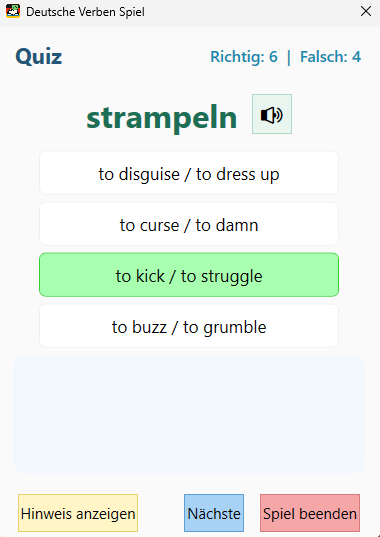
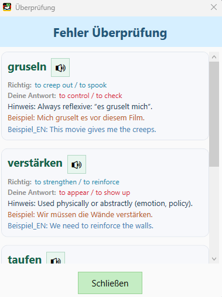

# 🇩🇪 Deutsche Verben Spiel

**Deutsche Verben Spiel** is an interactive WPF game for learning and practicing German verbs.  
Quiz yourself with randomized questions, listen to pronunciations, get hints and examples, and review your mistakes at the end!

---

## 📸 Screenshots

### Main Quiz Interface

### Review Window

---

## ✨ Features

- Randomized German verb quiz (no repeats until all are done)
- 4-option multiple choice (one correct, three random)
- Audio pronunciation (German TTS)
- Hints and example sentences in both German and English
- 10-second timer per question
- Score tracking: correct/incorrect answers
- Review window at the end to see all mistakes and missed questions
- No installation required—just run the `.exe`

---

## 🚀 Getting Started

1. **Download the latest release** from the [Releases page](https://github.com/hemrajchauhan/DeutscheVerbenSpiel/releases).
2. Extract all files. **Do not move or rename the `Database` folder or `verben.db`.**
3. Run `DeutscheVerbenSpiel.exe` to start playing.

---

## 🗃️ Database

- The game uses a local SQLite database: `Database/verben.db`
- Edit/add verbs using any SQLite editor, or request/submit new word sets via issues.

---

## 🔊 Speech

- Uses Windows Speech Synthesis (Text-to-Speech).
- Make sure you have a German voice installed:
  - Windows Settings → Time & Language → Language & Region → Add German
  - Download "Speech" for German if not present.

---

## 📖 License

**AGPL-3.0 License**  
See [LICENSE](https://github.com/hemrajchauhan/DeutscheVerbenSpiel/tree/master?tab=AGPL-3.0-1-ov-file) for full details.

- You may use, modify, and redistribute the software under the terms of the GNU Affero General Public License v3.0.
- If you run a modified version of this software over a network, you must make the source code available.

---

## 💬 Feedback & Contributions

- Report bugs, suggest features, or ask questions via [Issues](https://github.com/hemrajchauhan/DeutscheVerbenSpiel/issues).
- Pull requests are welcome!

---

Viel Spaß beim Lernen! 🇩🇪✨
